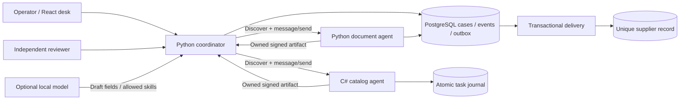

# Architecture and trust boundaries

## Ownership and approval

An agent owns its task and artifacts. The document agent persists task state in PostgreSQL; the C# agent persists its task receipts, message digests and artifacts in an atomic local journal before replying. Both bind HMAC signatures to the agent name, task ID, case context and canonical data. The coordinator verifies these bindings before constructing a proposal. Separate keys identify the two trusted services. Shared-secret HMAC establishes local trust; it is not public-key non-repudiation.

An operator owns the originating onboarding task. Service credentials cannot use the operator API. A different operator approves the canonical SHA-256 digest of the exact proposed record. Approval and an outbox command enter one PostgreSQL transaction. Delivery inserts a supplier and acknowledges the command in one transaction, with unique constraints on case ID and tax identifier. A duplicate tax identifier becomes a visible terminal conflict and does not stall unrelated commands.

Coordination holds a PostgreSQL advisory transaction lock per case. Updates also fence the case revision and reject terminal states. Cancellation increments that revision, so a late agent response cannot overwrite it. Missing information increments the application revision but resumes the same document task. Agents receive deterministic message IDs for retry deduplication.

## Protocol profile

The vendored schemas are exact tagged files with SHA-256 provenance in `contracts/sources.json`:

- [A2A v0.2.0](https://github.com/a2aproject/A2A/releases/tag/v0.2.0)
- [A2A v0.3.0](https://github.com/a2aproject/A2A/releases/tag/v0.3.0)

Python publishes both discovery paths, with v0.3 cards at `/.well-known/agent-card.json`. It supports `message/send`, `message/stream`, `tasks/get` and `tasks/cancel` for its bounded skills. Streams emit a durable task snapshot, returned artifact events and a final status event; they are not live token streams or an indefinitely subscribed event feed. The synchronous catalog advertises `streaming: false` and rejects cancellation of its already completed task with the standard task error.

New coordinator tasks allocate their own context. Document/catalog tasks use that case context. Coordinator tasks can wait for documents or human review; protocol clients cannot grant approval through messages. The catalog and Python adapters are implemented directly against pinned contracts, without claiming complete SDK or protocol certification. Current pairing tests validate actual C# cards and task responses against the same official v0.3 schema used by Python.

The coordinator uses configured service URLs, verifies advertised identity/skills/version and never follows an arbitrary URL from an AgentCard. Plain HTTP `/direct` accepts `{data, contextId, messageId, taskId?}` without the JSON-RPC envelope or discovery. It reuses application task receipts and business rules so the comparison does not trade away duplicate prevention.

## Limits and deployment boundaries

Python admits 16 concurrent connections by default and enforces an absolute request deadline. C# Kestrel caps connections, headers, body size and concurrent application requests, with explicit body deadlines and rejection of transfer-encoding ambiguity. Both reject oversized or incomplete input, ambiguous credentials, unconfigured Host authorities and untrusted browser origins, and return bounded public errors. Browser responses use a strict same-origin content policy; access keys are held only in memory.

The local environment uses static bearer credentials and isolated HTTP networking. A public deployment needs TLS termination, short-lived identity credentials, an explicit operator directory, access auditing and a retention policy. No production IAM provider is represented by the local key setup.

C# retains at most 1,000 task receipts by default and rejects new tasks at capacity while allowing existing receipts to be read/replayed. Its journal is single-writer and persisted on a named volume. PostgreSQL retains the case history; operators must manage database capacity and backups. Only one C# process may write a given journal directory.

## Product and engineering tradeoffs

The business problem is fragmented supplier evidence: an operator otherwise coordinates checks manually and can accidentally approve a record that changed after review. The casebook makes ownership, missing input and exact approval visible. It demonstrates service contracts, delivery ownership, failure recovery and human decision boundaries without claiming a live commercial deployment.

A2A is useful when independent teams own discoverable skills and task lifecycles. For this small fixed local topology, direct HTTP is simpler and uses fewer requests and bytes. Short local timing samples vary with host load. Neither protocol supplies database atomicity or approval authorization. Those guarantees remain application responsibilities. The measured comparison is in [evaluation](evaluation.md).
